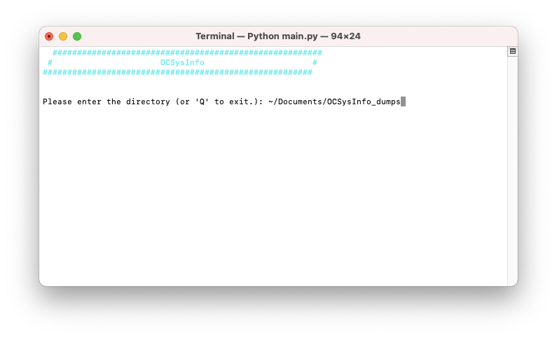
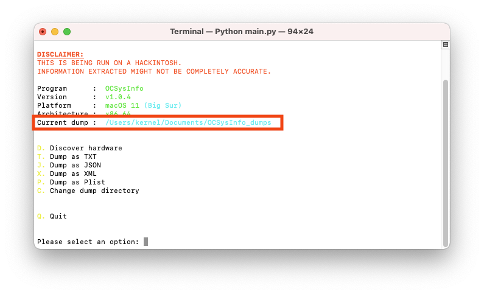
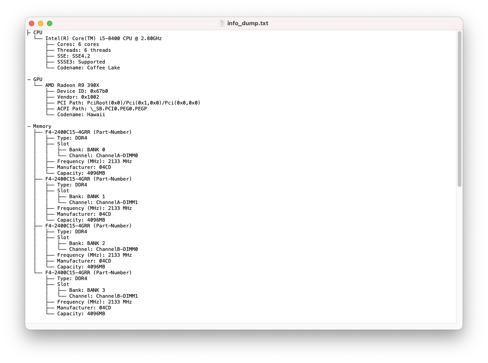
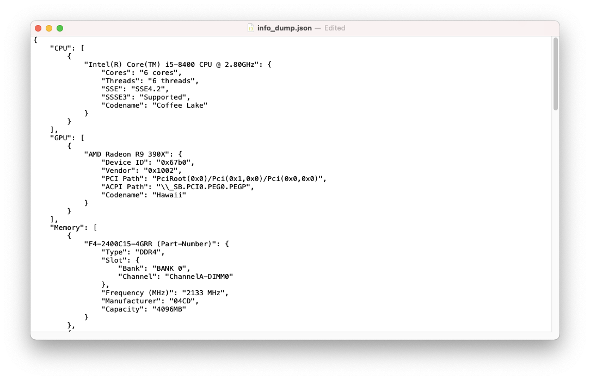
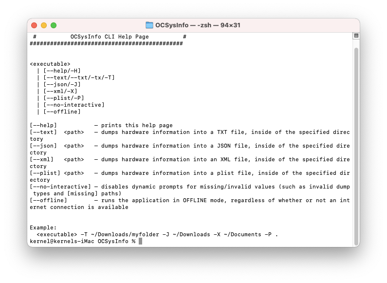

## OCSysInfo Usage


<u>IMPORTANT</u>: Laptop users: we advise that you disconnect any external USB devices from your machine before attempting to run OCSysInfo, as this may detect a lot of ambiguous devices which may confuse you.

So, you’ve finally ran the application, now you want to know what functionalities it contains? Well, we’ve got you covered there! 

Firstly, we assume you want to see your hardware? After you’ve ran the application, simply type `d` and hit `ENTER`/`RETURN`. You should be greeted with the following screen:


If you scroll down, you should be able to find some more options:

```
R. Return
T. Dump as TXT
J. Dump as JSON
X. Dump as XML
P. Dump as Plist
C. Change dump directory
Q. Quit
```

You can type `r` and hit `ENTER`/`RETURN` to return to the main menu from here. We will continue with what each option does there.

So, `d` (discover hardware), `r` (return) and `q` (quit) are pretty self-explanatory. However, you may not be familiar with the rest. So let’s explain each one.

## Change dump directory — Option (C)

Firstly, let’s create a directory which will be useful for our example here. We’ll create a new directory in our `Documents` folder called `OCSysInfo_dumps` (it doesn’t really matter where it’s located or what it’s called, this just serves as an example.)

To do this, we’ll do it through the terminal; we’ll simply run (since we’re running macOS):

```sh
# This would be the same for Linux users
# if they wish to do it via terminal.
mkdir ~/Documents/OCSysInfo_dumps
```

<br />

Now, onto what this option does! <br />

This option allows you to alter the directory in which the dump files (we’ll touch more on these later) will be placed into. You can run it both during the hardware discovery section, or at the main menu. Simply type `c` and hit `ENTER`/`RETURN`.

You should be greeted with the following screen:


Here, you would want to supply a path to the wanted directory. For our example, we’ll want to redirect them into our `OCSysInfo_dumps` directory, which is located inside of `~/Documents`.

To do this, we simply supply the following: `~/Documents/OCSysInfo_dumps`



Press `ENTER`/`RETURN`. Afterwards, you should be returned to the main menu, and the dump directory should change to the supplied one!



<br />

## Dump as TXT — Option (T)

The `Dump as TXT` option merely reflects the format used in `D. Discover Hardware` into a TXT file. Here is a quick example of how a hardware information dump inside of a TXT file would look like:



<br />

## Dump as JSON — Option (J)

The `Dump as JSON` option provides hardware information inside of a JSON file. Here is a quick example of how that sort of data would look like:



<br />

## Dump as XML — Option (X)

The `Dump as XML` option provides hardware information inside of an XML file. <br />


<u>For the time being, this option is not functional due to a dependency being broken</u> — `dicttoxml`. <br />

See more [here](https://github.com/quandyfactory/dicttoxml/issues/91).

After it’s been patched, this section will be updated.

<br />

## Dump as Plist — Option (P)

The `Dump as Plist` option provides hardware information inside of a Plist file. Here is a quick example of how that sort of data would look like (through `ProperTree`):


<br />

---

There’s also another utility built into OCSysInfo, which allows you to dump the hardware information without having to interact with the TUI; you can also run the application in `offline` mode.

In order to invoke the help page, you simply do the following:

```sh
# When running the binary
./ocsysinfo_osx_x86_64 -H

# When running the python script
python main.py -H
```

Which should print the following:



Let’s run through a quick example of dumping hardware information into a TXT and JSON file without interacting with the TUI, then we’ll break down everything.

In order to achieve this, we will run the following:

```sh
# When running the binary
./ocsysinfo_osx_x86_64 -T ~/Documents/OCSysInfo_dumps -J ~/Documents/OCSysInfo_dumps

# When running the python script
python main.py -T ~/Documents/OCSysInfo_dumps -J ~/Documents/OCSysInfo_dumps
```

Here, we use the `-T` flag (whose aliases are `--txt`, `-tx` and `--text`), and specify a path immediately after. That is the argument format that the flag parser follows. If, by any chance, it detects that a dump type was specified, but no path was provided, it will prompt the user, after, to supply one. <br />
The same is applied to the `-J` flag (whose alias is `--json`)


<u>NOTE</u>: You can disable the prompts by supplying the `--no-interactive` flag; however, the application will exit and fail if there are missing path values.

In our case, we’ve supplied both dump types the same path, so they will be there. 

### Table of flags

| Flag               | Aliases              | Description                                        | Example usage      |
|--------------------|----------------------|----------------------------------------------------|--------------------|
| `--help`           | `-H`                 | Prints the help page.                              | `--help`           |
| `--text`           | `--txt`, `-tx`, `-T` | Dumps the hardware information into a TXT file.    | `--text <path>`    |
| `--json`           | `-J`                 | Dumps the hardware information into a JSON file.   | `--json <path>`    |
| `--xml`            | `-X`                 | Dumps the hardware information into an XML file.   | `--xml <path>`     |
| `--plist`          | `-P`                 | Dumps the hardware information into a Plist file.  | `--plist <path>`   |
| `--no-interactive` | No aliases.          | Disables prompting if any path values are missing. | `--no-interactive` |
| `--offline`        | No aliases.          | Runs the program in `offline` mode.                | `--offline`        |

<br />

Voila! Now you’re ready to utilise the application to its fullest potential.